# Contexto

## Stack
-   Node.js
-   Typescript
-   React
-   Prisma
-   PostgreSQL
-   Vite

## Telas
### Login/Cadastro
#### Frontend
- Formulário de Login com email e senha, ou pelo google.
- Formulário de Cadastro com email e senha, ou pelo google.

#### Diagramas
- Login
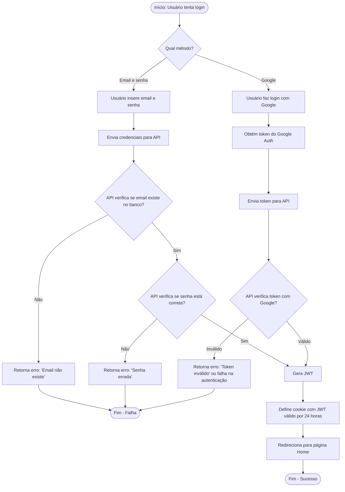

- Cadastro
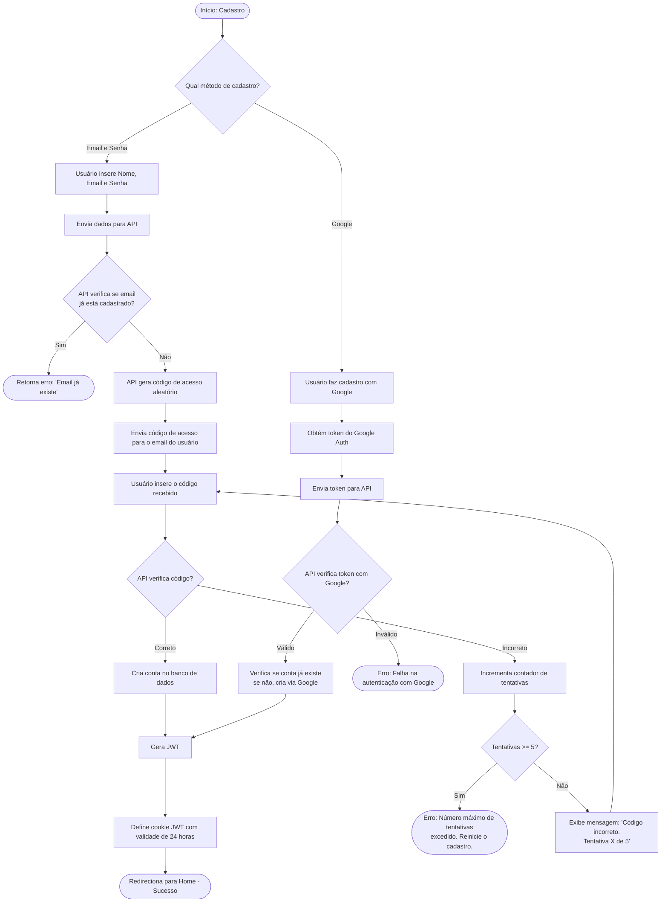

### Home
#### Frontend
- Barra de pesquisa com filtros[Titulo ou Conteúdo, Data ou Categoria]
- Seção de Anotações deve ser um Scroll.
- Card Anotações deve possuir Título, Categoria, Conteúdo e Data de Modificação.
- Botão flutuante para criar nova anotação localizado no inferior direito da página.
- Menu lateral na esquerda com opcoes [Home, Configurações, Lixeira]

#### Diagramas
- Home
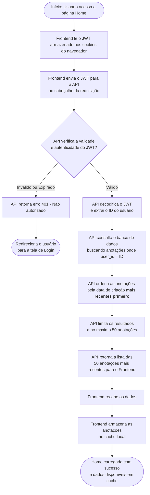
- Barra de Pesquisa
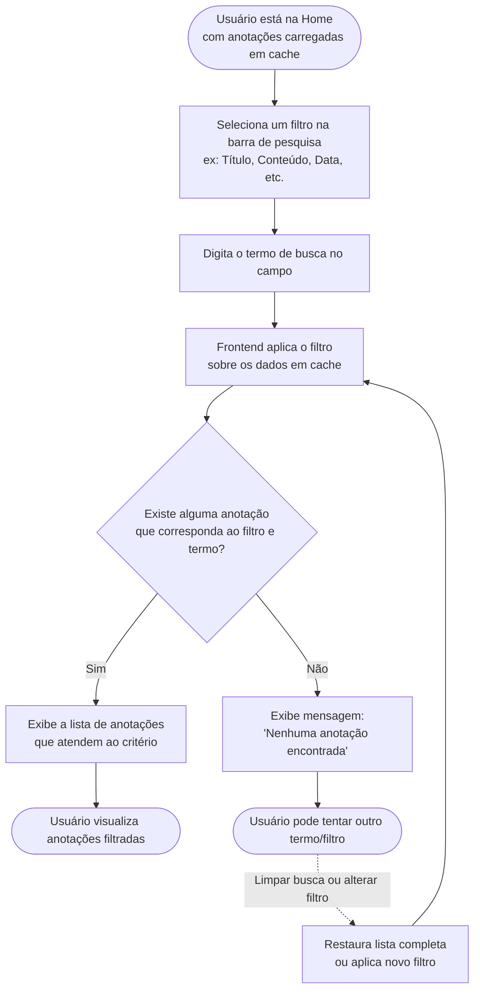

- Seção de Anotações
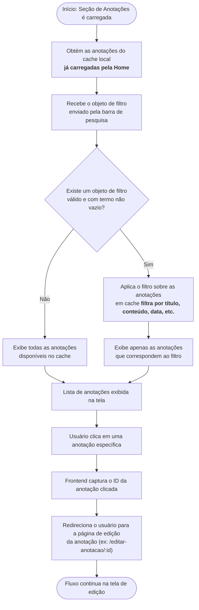

- Botão Flutuante
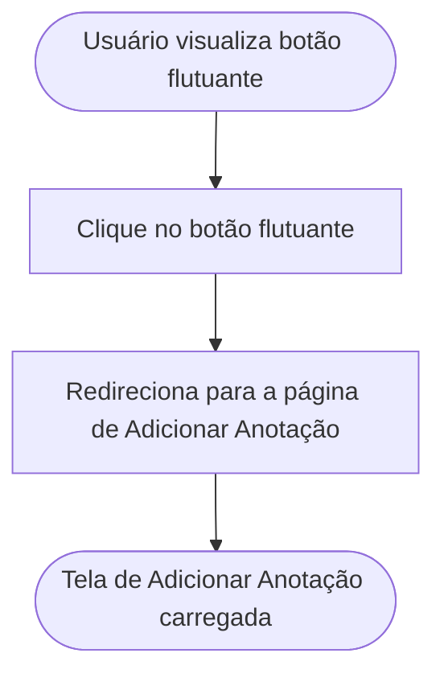

### Adicionar Anotação
#### Frontend
- Formulário com campos de Titulo, Categoria, Counteúdo.
- Campo Categoria deve listar 5 categorias com mais anotações e um input para pesquisar ou adicionar outra se nao existir.
- Botão Salvar.
- Botão Cancelar.

#### Diagramas

- Campo Categoria
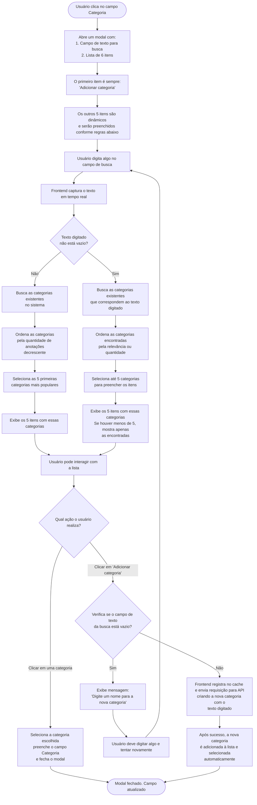

- Botão Salvar
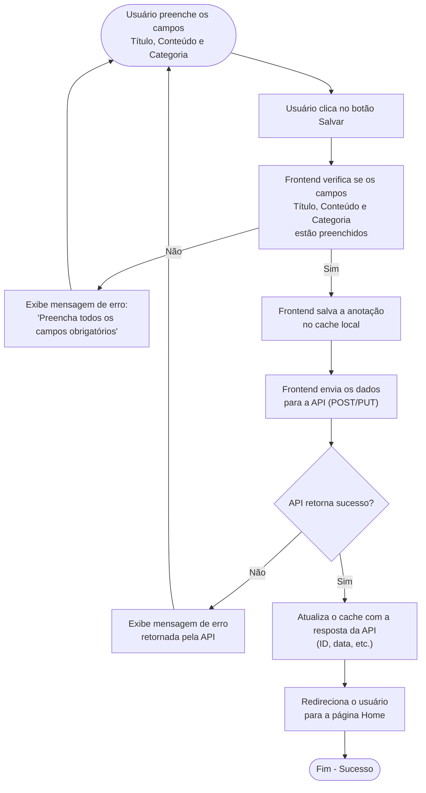

- Botão Cancelar
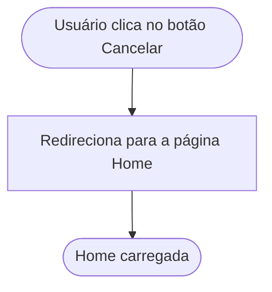

### Editar Anotação
#### Frontend
- Formulário com Titulo, Categoria e Conteúdo somente visualização se modo visualização.
- Botão Editar.
- Formulário Titulo, Categoria e Conteúdo em modo edição se modo editar.
- Botão Salvar.
- Botão Cancelar.

#### Diagramas
- Editar Anotação
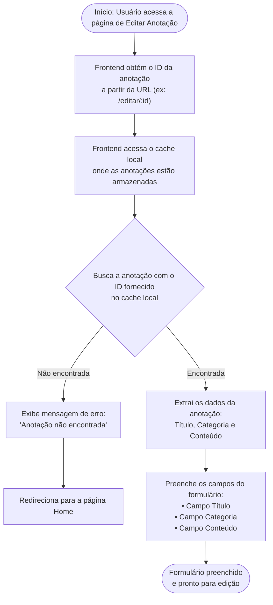

- Campo Título, Categoria e Conteúdo
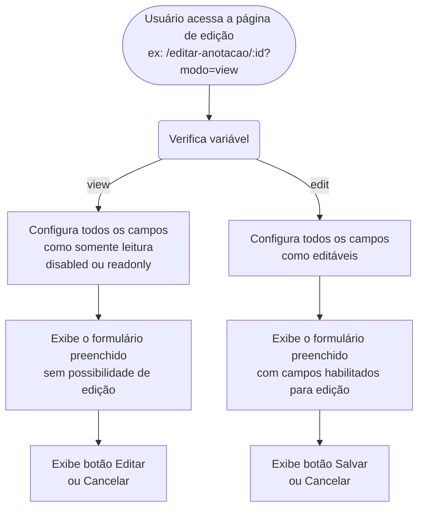

- Botão Editar
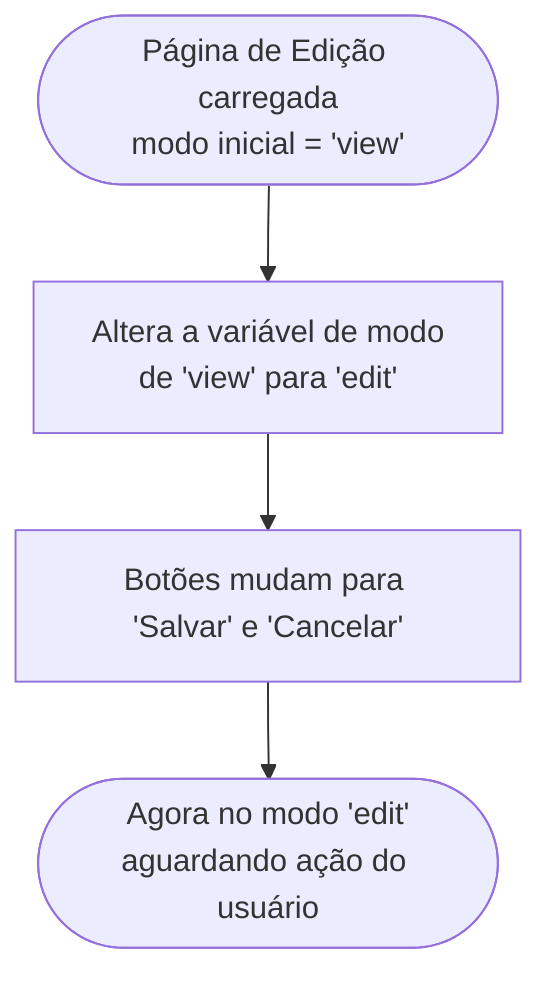

- Botão Cancelar
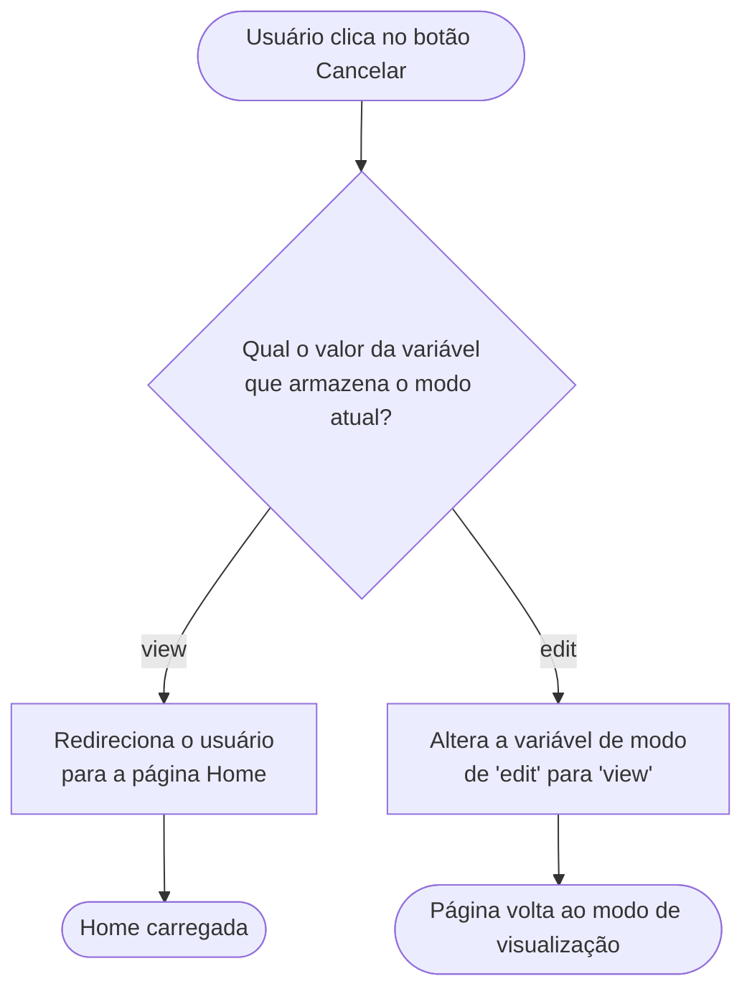
- Botão Salvar
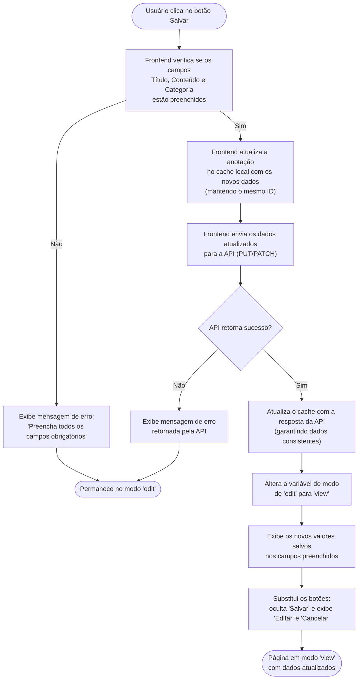